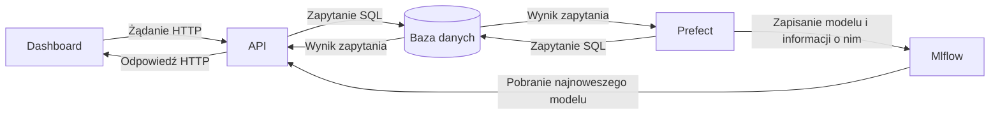

# Dashboard AirBnb
Aplikacja składa się z dwóch komponentów:
- Przeglądu danych
    - Prezentuje statystyki danych
    - Użytkownik może zmieniać liczbę rekordów wyświetlanych w oknie podglądu danych
    - Wsparcie dla paginacji, ułatwiające użytkownikowi przeglądanie tak dużego zbioru danych jak AirBnB
- Predykcji ceny za noc wynajmowanego podmiotu
    - Użytkownik uzupełnia cechy dotyczące jego samego i podmiotu, który chce wynajmować
    - Na podstawie tych cech wyliczana jest sugerowana cena za każdą noc wynajmu

# Architektura


# Deploy

Podstawowym sposóbem dystrybucji aplikacji jest plik `docker-compose.yml` w katalogu `docker`. Po wejściu do katalogu `docker`, wystarczy uruchomić:
```bash
docker compose up
```
Po wykonaniu polecenia i poczekaniu paru minut, wszystkie komponenty powinny być aktywne.
- Dashboard: domyślnie na porcie 80
- API: domyślnie na porcie 2137
- Baza danych: domyślnie na porcie 5432
- Serwer Prefect(+workflow): domyślnie na porcie 4200
- Serwer Mlflow: domyślnie na porcie 5000